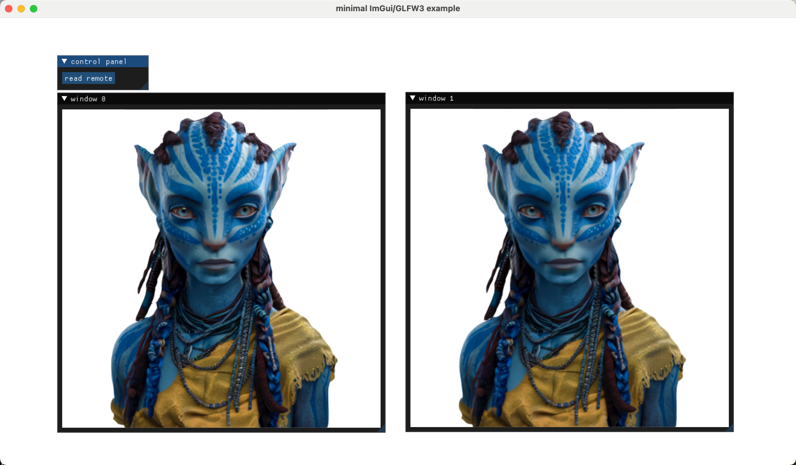

Naive IMGUI for rendering and interaction. Don't actually "render" but receive an image from a third-party remote renderer (e.g. nvdiffrast or gaussian splatting).


## Base Concept

The renderer, running on the server, receives the camera from the remote viewer and sends the rendering result to the remote viewer.

On the other hand, the viewer, running on the client, receives the image from the remote renderer and sends the camera information.

From the renderer, you can send images as a list, and the viewer will create multiple windows for displaying these images, with each window showing one image.



## Usage

You can keep the viewer running and send images to the viewer anytime.

You can also run your program on a server first without a connected viewer. Any time you create a viewer, all the images sent after the viewer creation will be displayed automatically.

After sending lists of images from the renderer, the viewer can continuously read them from the connection, performing like real-time rendering, also it can read one by one. 

### Remote Viewer

Running on the client, for displaying images.

Just run ```python start.py. ```


### Remote Renderer

Running on the server, for rendering images and sending them to the remote viewer.

Below are some code snippets:

#### Real-time rendering

```python
remote_viewer = RemoteViewer("xx.xx.xx.xx",12345) # set connection info
while True:
    remote_viewer.require_camera_from_remote(True) # ask for camera information
    remote_info = remote_viewer.read() # read from the network, it returns a dict
    if(remote_info["status"]==1): # status 0: failure, status 1: read success
            if("camera" in remote_info): 
                cam = remote_info['camera']
            else:
                cam = default_cam
            image = render(cam)  # run you rendering function!
            image1 = render(cam)  # run you rendering function!
            remote_viewer.send_images([image,image1]) # the image should be a list of (H,W,3) in np.array (0-255) to ensure the client can interpret
```

We send a list with two images, so the viewer will show two windows. 


#### Display an image

```python
remote_viewer = RemoteViewer("xx.xx.xx.xx",12345) # set connection info
remote_viewer.send_images([image],single=True) # it will connect the client automatically and tell it that only one list will be sent, so don't wait for more images.
```

Note that after executing this function, the client will read no more data after reading this list, unless you click the button: read remote.  Notably, the network buffer storage is limited. If you send too many images to the viewer but the viewer has not read them, the network pipeline may break, depending on your network situation. You can just restart your viewer without affecting the program on the server.


### More

Regarding the viewer,  I use imgui: image for presenting the images. You can change it freely.

You can also change the information that needs to be transferred between the server and the client. The only recommendation is to use the ```read()``` function to receive all types of data. Otherwise, you need to re-code the framework (It is still easy for most of people).

Just be aware that the ```socker.recv()``` in ```read()``` function will hang up until receiving the data. 

If any bug happens, just restart the viewer. Don't worry, your program on your server will not be affected.

## ENJOY!


